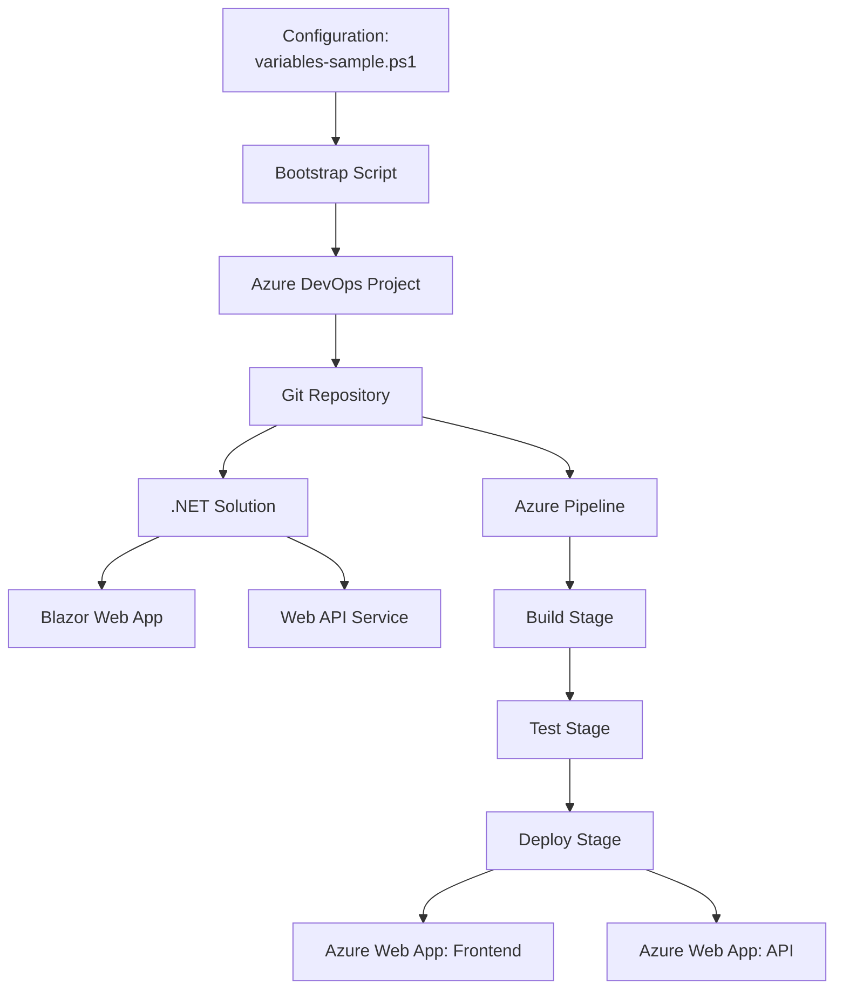
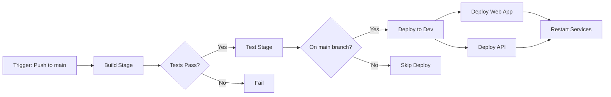

# Azure DevOps Project Bootstrapper


A comprehensive PowerShell-based automation toolkit for bootstrapping Azure DevOps projects with .NET solutions, CI/CD pipelines, and deployment workflows.

## 📋 Table of Contents

- [Overview](#overview)
- [Features](#features)
- [Architecture](#architecture)
- [Prerequisites](#prerequisites)
- [Repository Contents](#repository-contents)
- [Getting Started](#getting-started)
- [Usage](#usage)
- [Configuration](#configuration)
- [Pipeline Workflow](#pipeline-workflow)
- [Cleanup](#cleanup)
- [Troubleshooting](#troubleshooting)
- [Resources](#resources)

## 🎯 Overview

This project automates the complete setup of an Azure DevOps environment, including:
- Creating Azure DevOps projects and repositories
- Generating .NET solutions with Blazor and Web API projects
- Configuring CI/CD pipelines with multi-stage deployments
- Setting up Git repositories with proper branching strategies
- Deploying applications to Azure App Services

> **💡 Note:** While this bootstrapper is configured for .NET 9.0 with Blazor and Web API, it can be easily customized to support other frameworks and programming languages (Node.js, Python, Java, etc.) by modifying the project generation and pipeline template sections.

## ✨ Features

- **🚀 Automated Project Creation**: Creates Azure DevOps projects, repositories, and pipelines automatically
- **🔧 .NET Solution Scaffolding**: Generates complete .NET solutions with Blazor (frontend) and Web API (backend) projects
- **📦 CI/CD Pipeline**: Multi-stage pipeline with Build → Test → Deploy workflow
- **🔐 Secure Configuration**: Environment variable-based secrets management
- **🌐 Azure Integration**: Deploy directly to Azure App Services with service connections
- **🧹 Easy Cleanup**: Automated cleanup script to remove all created resources
- **📝 Git Best Practices**: Automatic `.gitignore` configuration to exclude sensitive files

## 🏗️ Architecture



## 📦 Repository Contents

```
azdo-project-bootstrapper/
├── .powershell/
│   ├── azdo-project-bootstrapper.ps1  # Main bootstrap script
│   ├── cicd-template.yml              # Azure Pipeline YAML template
│   ├── clean-up.ps1                   # Cleanup script
│   ├── variables-sample.ps1           # Sample configuration file
│   └── variables.ps1                  # Your configuration (gitignored)
└── README.md                          # This file
```

### File Descriptions

| File | Purpose |
|------|---------|
| `azdo-project-bootstrapper.ps1` | Main automation script that orchestrates the entire setup process |
| `cicd-template.yml` | Azure Pipeline template with build, test, and deployment stages |
| `clean-up.ps1` | Removes all created Azure DevOps resources and local workspace |
| `variables-sample.ps1` | Template configuration file with all required settings |
| `variables.ps1` | Your actual configuration (excluded from version control) |

## 📋 Prerequisites

Before using this bootstrapper, ensure you have:

1. **PowerShell 7.0+**
   ```powershell
   $PSVersionTable.PSVersion
   ```

2. **Azure CLI with DevOps Extension**
   ```powershell
   # Install Azure CLI
   winget install Microsoft.AzureCLI
   
   # Install DevOps extension
   az extension add --name azure-devops
   ```

3. **Git**
   ```powershell
   git --version
   ```

4. **.NET SDK 9.0+**
   ```powershell
   dotnet --version
   ```

5. **Azure DevOps Organization**
   - Create at [dev.azure.com](https://dev.azure.com)

6. **Azure DevOps Personal Access Token (PAT)**
   - Required scopes: Project (Read, Write), Code (Read, Write, Manage), Build (Read, Execute)
   - [Create PAT](https://learn.microsoft.com/en-us/azure/devops/organizations/accounts/use-personal-access-tokens-to-authenticate)

7. **Azure Subscription & Resources** (for deployment)
   - Active Azure subscription required for App Service deployments
   - **Assumption:** Azure resources (App Services, Resource Groups) are created beforehand
   - You can automate resource creation using:
     - [Azure Bicep](https://learn.microsoft.com/en-us/azure/azure-resource-manager/bicep/overview) (Infrastructure as Code)
     - [Terraform](https://www.terraform.io/) (Multi-cloud IaC)
     - Azure Portal or Azure CLI for manual creation

## 🚀 Getting Started

### Step 1: Clone the Repository

```powershell
git clone <your-repository-url>
cd azdo-project-bootstrapper
```

### Step 2: Configure Your Settings

```powershell
# Copy the sample configuration
Copy-Item .\.powershell\variables-sample.ps1 .\.powershell\variables.ps1

# Edit with your settings
notepad .\.powershell\variables.ps1
```

### Step 3: Update Configuration Values

Edit `.powershell\variables.ps1` with your specific values (this file is created from `variables-sample.ps1` and should not be committed to version control):

```powershell
# --- Azure DevOps org & auth
$env:AZDO_ORG_URL = "https://dev.azure.com/YOUR-ORG-NAME"
$env:AZDO_PAT     = "YOUR-PERSONAL-ACCESS-TOKEN"

# --- Local workspace directory for solution creation
$LocalWorkspaceDir = "c:\workspace\my-project"

# --- Central configuration
$Config = @{
  ProjectName        = "MyAwesomeProject"
  PipelineName       = "MyApp-CI-CD"
  DefaultBranch      = "main"
  VmImage            = "ubuntu-latest"
  BuildConfiguration = "Release"
  DotNetFramework    = "net9.0"
  DotNetVersion      = "9.0.x"
  ServiceConnection  = "azure-service-connection"
  WebAppNameDev      = "myapp-web-dev"
  ApiAppNameDev      = "myapp-api-dev"
  ResourceGroupDev   = "rg-myapp-dev"
  EnvironmentName    = "Development"
  SolutionName       = "MyApp"
  WebProjectName     = "MyApp.Web"
  ApiProjectName     = "MyApp.ApiService"
}
```

### Step 4: Run the Bootstrap Script

```powershell
cd .powershell
.\azdo-project-bootstrapper.ps1
```

## 📖 Usage

### Basic Usage

```powershell
# Run with configuration from variables.ps1
.\azdo-project-bootstrapper.ps1
```

### Advanced Usage with Parameters

```powershell
# Override specific values
.\azdo-project-bootstrapper.ps1 `
  -OrgUrl "https://dev.azure.com/myorg" `
  -Pat "your-pat-token" `
  -Project "MyProject" `
  -Repo "MyRepo" `
  -PipeName "MyPipeline"
```

### What the Script Does

The bootstrap script executes 12 automated steps:

1. ✅ **Configure Azure DevOps CLI** - Sets up authentication and defaults
2. ✅ **Check/Create Project** - Ensures Azure DevOps project exists
3. ✅ **Verify Repository** - Confirms default repository is available
4. ✅ **Setup Local Workspace** - Creates working directory
5. ✅ **Initialize Git** - Sets up local Git repository
6. ✅ **Configure .gitignore** - Adds proper ignore patterns
7. ✅ **Create README** - Generates initial documentation
8. ✅ **Generate .NET Solution** - Creates Blazor and Web API projects
9. ✅ **Create Pipeline YAML** - Generates customized CI/CD pipeline
10. ✅ **Commit & Push** - Pushes code to Azure DevOps repository
11. ✅ **Create Pipeline** - Registers pipeline in Azure DevOps
12. ✅ **Queue Pipeline Run** - Triggers initial build

### Service Connection Setup

The script will pause and prompt you to create an Azure Service Connection:

```
IMPORTANT: Service Connection Required
Expected Service Connection Name: your-service-connection-name

To create the service connection:
  1. Go to: https://dev.azure.com/yourorg/YourProject/_settings/adminservices
  2. Click 'New service connection'
  3. Select 'Azure Resource Manager'
  4. Name it: your-service-connection-name
```

**Steps to Create Service Connection:**

1. Navigate to Project Settings → Service Connections
2. Click **+ New service connection**
3. Select **Azure Resource Manager**
4. Choose **Service principal (automatic)**
5. Select your subscription and resource group
6. Enter the name from your configuration (specified in `variables.ps1`)
7. Click **Save**

## ⚙️ Configuration

### Configuration Reference

| Parameter | Description | Example |
|-----------|-------------|---------|
| `AZDO_ORG_URL` | Your Azure DevOps organization URL | `https://dev.azure.com/myorg` |
| `AZDO_PAT` | Personal Access Token for authentication | `••••••••••••••••` |
| `LocalWorkspaceDir` | Local directory for code generation | `c:\workspace\myapp` |
| `ProjectName` | Azure DevOps project name | `MyAwesomeProject` |
| `PipelineName` | CI/CD pipeline name | `MyApp-CI-CD` |
| `DefaultBranch` | Main Git branch name | `main` or `develop` |
| `VmImage` | Azure Pipeline agent image | `ubuntu-latest`, `windows-latest` |
| `BuildConfiguration` | .NET build configuration | `Release`, `Debug` |
| `DotNetFramework` | Target .NET framework | `net9.0`, `net8.0` |
| `DotNetVersion` | .NET SDK version | `9.0.x`, `8.0.x` |
| `ServiceConnection` | Azure service connection name | `azure-prod-connection` |
| `WebAppNameDev` | Azure Web App name (frontend) | `myapp-web-dev` |
| `ApiAppNameDev` | Azure Web App name (backend) | `myapp-api-dev` |
| `ResourceGroupDev` | Azure resource group | `rg-myapp-dev` |
| `EnvironmentName` | Azure DevOps environment | `Development`, `Staging` |
| `SolutionName` | .NET solution name | `MyApp` |
| `WebProjectName` | Blazor project name | `MyApp.Web` |
| `ApiProjectName` | Web API project name | `MyApp.ApiService` |

### Security Best Practices

**❌ Never commit these files:**
- `variables.ps1` (contains secrets - create from `variables-sample.ps1`)
- Any files matching `*.secrets.*`
- `.env` files

**✅ The `.gitignore` automatically excludes:**
```gitignore
variables.ps1
variables.*.ps1
*.secrets.*
.env
.env.*
```

**✅ What to commit:**
- `variables-sample.ps1` (template without sensitive data)

## 🔄 Pipeline Workflow

The generated Azure Pipeline follows a multi-stage approach:



### Stage 1: Build

- Restores NuGet packages
- Builds solution
- Publishes both Web and API projects
- Creates deployment artifacts
- Publishes artifacts for deployment

### Stage 2: Test

- Runs unit tests
- Collects code coverage
- Publishes test results

### Stage 3: Deploy to Development

- Downloads build artifacts
- Deploys Web Frontend to Azure App Service
- Deploys API Service to Azure App Service
- Restarts both services
- Only runs on main branch

### Pipeline Variables

The pipeline uses these variables (configured in `cicd-template.yml`):

| Variable | Source | Description |
|----------|--------|-------------|
| `buildConfiguration` | Config | Build configuration (Release/Debug) |
| `dotNetVersion` | Config | .NET SDK version |
| `serviceConnection` | Config | Azure service connection |
| `webAppNameDev` | Config | Frontend app service name |
| `apiAppNameDev` | Config | Backend app service name |
| `resourceGroupDev` | Config | Target resource group |

## 🧹 Cleanup

To remove all created resources:

```powershell
cd .powershell
.\clean-up.ps1
```

### What Gets Deleted

- ❌ Azure DevOps project (including repositories and pipelines)
- ❌ Local workspace directory
- ✅ Azure resources remain (Web Apps, Resource Groups)

### Safety Features

The cleanup script includes:
- **Confirmation prompt** - Type `DELETE` to confirm
- **Verbose logging** - Shows exactly what's being removed
- **Force flag** - Continue on errors with `-Force`
- **Skip confirmation** - Use `-SkipConfirmation` for automation

### Cleanup Examples

```powershell
# Standard cleanup with confirmation
.\clean-up.ps1

# Skip confirmation prompt
.\clean-up.ps1 -SkipConfirmation

# Continue even if errors occur
.\clean-up.ps1 -Force

# Combine flags
.\clean-up.ps1 -SkipConfirmation -Force
```

## 🔧 Troubleshooting

### Common Issues

#### Issue: "Azure DevOps CLI configuration failed"

**Solution:**
```powershell
# Verify Azure CLI installation
az --version

# Install DevOps extension
az extension add --name azure-devops

# Update extension
az extension update --name azure-devops
```

#### Issue: "Failed to push code to Azure DevOps"

**Solution:**
1. Verify PAT has correct permissions (Code: Read, Write, Manage)
2. Check if PAT has expired
3. Ensure organization URL is correct
4. Configure Git user identity:
```powershell
git config --global user.name "Your Name"
git config --global user.email "your.email@example.com"
```

#### Issue: "Service connection not found"

**Solution:**
1. Create service connection manually in Azure DevOps
2. Ensure name exactly matches `ServiceConnection` in your configuration (`variables.ps1`)
3. Grant necessary permissions to the service principal

#### Issue: ".NET SDK not found"

**Solution:**
```powershell
# Install .NET 9.0 SDK
winget install Microsoft.DotNet.SDK.9

# Verify installation
dotnet --list-sdks
```

#### Issue: "Pipeline creation failed"

**Solution:**
1. Verify you have Build Administrator permissions
2. Check project settings allow pipeline creation
3. Ensure YAML file path is correct
4. Review pipeline creation logs for specific errors

### Debug Tips

**Enable verbose output:**
```powershell
$VerbosePreference = "Continue"
.\azdo-project-bootstrapper.ps1
```

**Check Azure CLI login:**
```powershell
az account show
az devops project list
```

**Validate PAT token:**
```powershell
$env:AZURE_DEVOPS_EXT_PAT = "your-pat"
az devops project list --org "https://dev.azure.com/yourorg"
```

## 📚 Resources

### **Azure DevOps Documentation**
- [Azure DevOps Documentation (Overview)](https://learn.microsoft.com/en-us/azure/devops/?view=azure-devops)
- [Azure Pipelines Documentation](https://learn.microsoft.com/en-us/azure/devops/pipelines/?view=azure-devops)

---

### **Pipelines YAML Concepts**
- [Get Started with YAML Pipelines](https://learn.microsoft.com/en-us/azure/devops/pipelines/get-started/pipelines-get-started?view=azure-devops)
- [Azure Pipelines YAML Schema Reference](https://learn.microsoft.com/en-us/azure/devops/pipelines/yaml-schema/?view=azure-pipelines)
- [Pipeline Resources (Triggers, Repos, Containers)](https://learn.microsoft.com/en-us/azure/devops/pipelines/process/resources?view=azure-devops)

---

### **Multi-Stage Pipelines**
- [Create Your First Pipeline (includes multi-stage concepts)](https://learn.microsoft.com/en-us/azure/devops/pipelines/create-first-pipeline?view=azure-devops)

---

### **Service Connections**
- [Service Connections in Azure Pipelines](https://learn.microsoft.com/en-us/azure/devops/pipelines/library/service-endpoints?view=azure-devops)
- [Azure DevOps Service Connection Security Best Practices](https://microsoft.github.io/code-with-engineering-playbook/CI-CD/dev-sec-ops/azure-devops-service-connection-security/)

---

### **Repository & Branch Policies**
- [Branch Policies in Azure Repos](https://learn.microsoft.com/en-us/azure/devops/repos/git/branch-policies?view=azure-devops)
- [Repository Settings and Permissions](https://learn.microsoft.com/en-us/azure/devops/repos/git/repository-settings?view=azure-devops)

---

### **Azure DevOps CLI**
- [Azure DevOps CLI – Getting Started](https://learn.microsoft.com/en-us/azure/devops/cli/?view=azure-devops)
- [Azure DevOps CLI Command Reference](https://learn.microsoft.com/en-us/cli/azure/devops?view=azure-cli-latest)

---

### **PowerShell**
- [PowerShell 7+ Installation](https://learn.microsoft.com/en-us/powershell/scripting/install/installing-powershell-on-windows)
- [Hitchhiker's Guide to the PowerShell Module Pipeline](https://xainey.github.io/2017/powershell-module-pipeline/)
- [Quickly Making High-Quality PowerShell Modules](https://www.pr0mpt.com/2025-04-22-quickly-making-high-quality-powershell-modules-using-sampler/)

---

### **DevOps Governance & Best Practices**
- [Azure Pipelines YAML Templates (Reusable Governance Patterns)](https://learn.microsoft.com/en-us/azure/devops/pipelines/process/templates?view=azure-devops)
- [Azure Pipelines YAML Best Practices – Code With Engineering Playbook](https://microsoft.github.io/code-with-engineering-playbook/code-reviews/recipes/azure-pipelines-yaml/)

---

### **Pipeline as Code / Environment Approvals / Reusable Templates**
- [Azure Pipelines Templates Documentation](https://learn.microsoft.com/en-us/azure/devops/pipelines/process/templates?view=azure-devops)
- [Engineering Playbook – YAML Pipelines](https://microsoft.github.io/code-with-engineering-playbook/code-reviews/recipes/azure-pipelines-yaml/)

---

### **Authentication & Security**
- [Personal Access Tokens](https://learn.microsoft.com/en-us/azure/devops/organizations/accounts/use-personal-access-tokens-to-authenticate)

---

### **.NET Development**
- [.NET CLI Documentation](https://learn.microsoft.com/en-us/dotnet/core/tools/)
- [Blazor Documentation](https://learn.microsoft.com/en-us/aspnet/core/blazor/)
- [ASP.NET Core Web API](https://learn.microsoft.com/en-us/aspnet/core/web-api/)

---

### **Azure Services**
- [Azure App Service](https://learn.microsoft.com/en-us/azure/app-service/)
- [Azure DevOps Environments](https://learn.microsoft.com/en-us/azure/devops/pipelines/process/environments)

---

### **Tools & Extensions**
- [Azure CLI](https://learn.microsoft.com/en-us/cli/azure/)
- [Azure DevOps Extension for Azure CLI](https://github.com/Azure/azure-devops-cli-extension)
- [Git for Windows](https://git-scm.com/download/win)

## 🤝 Contributing

Contributions are welcome! Here's how you can help improve this project:

### How to Contribute

1. **Fork** the repository to your GitHub account
2. **Create a feature branch** from `main`
   ```powershell
   git checkout -b feature/your-feature-name
   ```
3. **Make your changes** and commit with clear, descriptive messages
4. **Submit a Pull Request** with:
   - Clear description of changes
   - Explanation of why the change is needed
   - Any related issue numbers
5. **Validate YAML** with Azure DevOps pipeline schema
   - Test pipeline changes in a dev environment
   - Ensure YAML syntax is valid
5. **Include tests** for PowerShell scripts (Optional)
   - Use Pester framework for PowerShell testing
   - Ensure all tests pass before submitting

### Contribution Ideas

- 🌟 Add support for additional .NET project templates
- 🌟 Implement multi-environment deployment (Staging, Production)
- 🌟 Add Docker containerization support
- 🌟 Create templates for different application types
- 🌟 Add infrastructure as code (Terraform/Bicep) templates

## 📝 License

This project is licensed under the MIT License - see the [LICENSE](LICENSE) file for details.

### MIT License Summary

Permission is hereby granted, free of charge, to any person obtaining a copy of this software and associated documentation files (the "Software"), to deal in the Software without restriction, including without limitation the rights to use, copy, modify, merge, publish, distribute, sublicense, and/or sell copies of the Software, and to permit persons to whom the Software is furnished to do so, subject to the following conditions:

The above copyright notice and this permission notice shall be included in all copies or substantial portions of the Software.

THE SOFTWARE IS PROVIDED "AS IS", WITHOUT WARRANTY OF ANY KIND, EXPRESS OR IMPLIED.

## 🎓 Learning Objectives

This bootstrapper demonstrates:

- ✅ Azure DevOps CLI automation
- ✅ Git workflow automation
- ✅ CI/CD pipeline configuration
- ✅ Multi-stage deployment strategies
- ✅ .NET solution scaffolding
- ✅ Infrastructure provisioning
- ✅ Security best practices (secrets management)
- ✅ PowerShell scripting patterns

---

## 👤 Connect with Siya Khumalo

[](https://www.linkedin.com/in/siyakhumalo-ms/)

Feel free to connect with me on LinkedIn for discussions about DevOps, Azure, automation, and software engineering!

---

**Made with ❤️ for DevOps automation enthusiasts**
