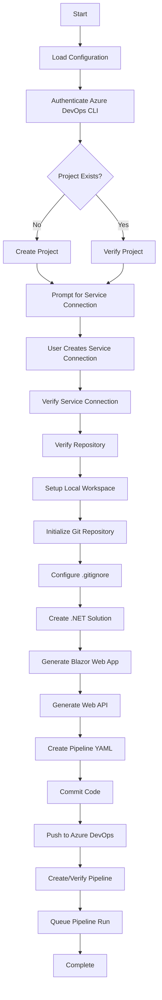

# Azure DevOps CI/CD Bootstrapper

A PowerShell automation tool that rapidly bootstraps Azure DevOps projects with a complete CI/CD pipeline for .NET applications. This tool eliminates manual setup overhead by automating project creation, repository initialization, and pipeline configuration.

## 🎯 Overview

This bootstrapper automates the entire Azure DevOps project setup process, creating a production-ready CI/CD environment in minutes. It generates a .NET solution with both a Blazor web application and Web API, configures Azure Pipelines, and handles all necessary Azure DevOps resources.

### What It Does

1. **Creates/Validates Azure DevOps Project** - Ensures your project exists and is properly configured
2. **Sets Up Repository** - Initializes Git repository with proper .gitignore configuration
3. **Generates .NET Solution** - Creates Blazor web app and Web API projects
4. **Configures CI/CD Pipeline** - Sets up Azure Pipeline with YAML configuration
5. **Pushes Initial Commit** - Commits and pushes all generated code
6. **Triggers First Build** - Queues initial pipeline run

## 📋 Prerequisites

Before running the bootstrapper, ensure you have:

- **PowerShell 5.1+** or **PowerShell Core 7+**
- **Azure CLI** with Azure DevOps extension
  ```powershell
  az extension add --name azure-devops
  ```
- **.NET SDK** (version specified in your config)
- **Git** installed and configured
- **Azure DevOps Organization** with appropriate permissions
- **Personal Access Token (PAT)** with the following scopes:
  - Project and Team (Read, Write, Manage)
  - Code (Read, Write)
  - Build (Read, Execute)
  - Service Connections (Read, Query, Manage)
- **Repository permissions** allowing the PAT's identity to contribute code

## 🚀 Getting Started

### Step 1: Clone the Repository

```bash
git clone https://github.com/siyakhumalodev/azdo-cicdbootstrap.git
cd azdo-cicdbootstrap
```

### Step 2: Configure Variables

Copy the sample variables file and customize it:

```powershell
cd .powershell
Copy-Item variables-sample.ps1 variables.ps1
```

Edit [`variables.ps1`](.powershell/variables.ps1) with your configuration:

```powershell
$Config = @{
    # Azure DevOps Settings
    ProjectName        = "MyDemoProject"
    PipelineName       = "MyApp-CI-CD"
    ServiceConnection  = "AzureServiceConnection"
    DefaultBranch      = "main"

    # .NET Project Settings
    SolutionName       = "MyAppSolution"
    WebProjectName     = "MyApp.Web"
    ApiProjectName     = "MyApp.Api"
    DotNetFramework    = "net8.0"
    DotNetVersion      = "8.x"

    # Azure Resources (Development)
    ResourceGroupDev   = "rg-myapp-dev"
    WebAppNameDev      = "webapp-myapp-dev"
    ApiAppNameDev      = "api-myapp-dev"
    EnvironmentName    = "Development"

    # Pipeline Configuration
    VmImage            = "ubuntu-latest"
    BuildConfiguration = "Release"
}
```

Set `$LocalWorkspaceDir` to a new path that does not already exist. The bootstrapper stops before changing Azure DevOps and prompts for another path when the configured directory already exists.

### Step 3: Set Environment Variables

Set your Azure DevOps credentials:

```powershell
$env:AZDO_ORG_URL = "https://dev.azure.com/YourOrganization"
$env:AZDO_PAT = "your-personal-access-token"
```

### Step 4: Run the Bootstrapper

```powershell
.\azdo-project-bootstrapper.ps1
```

Or specify parameters explicitly:

```powershell
.\azdo-project-bootstrapper.ps1 `
    -OrgUrl "https://dev.azure.com/YourOrg" `
    -Pat "your-pat-token" `
    -Project "MyProject" `
    -Repo "MyRepo" `
    -PipeName "MyPipeline"
```

## 📖 Usage Examples

### Example 1: Basic Setup

Minimal configuration using defaults from [`variables.ps1`](.powershell/variables.ps1):

```powershell
# Set credentials
$env:AZDO_ORG_URL = "https://dev.azure.com/Contoso"
$env:AZDO_PAT = "xyz123..."

# Run bootstrapper
.\azdo-project-bootstrapper.ps1
```

### Example 2: Custom Project Name

Override the project name while using other defaults:

```powershell
.\azdo-project-bootstrapper.ps1 -Project "CustomerPortal"
```

### Example 3: Complete Custom Configuration

Provide all parameters explicitly:

```powershell
.\azdo-project-bootstrapper.ps1 `
    -OrgUrl "https://dev.azure.com/Contoso" `
    -Pat "abc123xyz..." `
    -Project "ECommerceApp" `
    -Repo "ecommerce-main" `
    -PipeName "ECommerce-CI-CD-Pipeline"
```

### Example 4: Using Separate Repositories

Different project and repository names:

```powershell
.\azdo-project-bootstrapper.ps1 `
    -Project "EnterpriseApps" `
    -Repo "inventory-service" `
    -PipeName "Inventory-Pipeline"
```

## 🔄 Workflow Diagram



## 📁 Repository Structure

```
azdo-project-bootstrapper/
├── .gitignore                          # Git ignore rules
├── LICENSE                             # Project license
├── README.md                           # This file
└── .powershell/
    ├── azdo-project-bootstrapper.ps1  # Main bootstrapper script
    ├── cicd-template.yml              # Azure Pipeline YAML template
    ├── clean-up.ps1                   # Cleanup script for resources
    ├── variables-sample.ps1           # Sample configuration file
    └── variables.ps1                  # Your configuration (gitignored)
```

## 🔧 Configuration Reference

### Required Configuration Parameters

| Parameter | Description | Example |
|-----------|-------------|---------|
| `ProjectName` | Azure DevOps project name | `"MyProject"` |
| `PipelineName` | Name for the CI/CD pipeline | `"MyApp-Pipeline"` |
| `ServiceConnection` | Azure service connection name | `"AzureRM-Connection"` |
| `SolutionName` | .NET solution name | `"MyAppSolution"` |
| `WebProjectName` | Blazor web project name | `"MyApp.Web"` |
| `ApiProjectName` | Web API project name | `"MyApp.Api"` |

### Azure Resource Configuration

| Parameter | Description | Example |
|-----------|-------------|---------|
| `ResourceGroupDev` | Azure resource group for dev | `"rg-myapp-dev"` |
| `WebAppNameDev` | Web app name in Azure | `"webapp-myapp-dev"` |
| `ApiAppNameDev` | API app name in Azure | `"api-myapp-dev"` |

### Build Configuration

| Parameter | Description | Default |
|-----------|-------------|---------|
| `DotNetFramework` | Target framework | `"net8.0"` |
| `DotNetVersion` | .NET SDK version | `"8.x"` |
| `VmImage` | Azure Pipeline agent | `"ubuntu-latest"` |
| `BuildConfiguration` | Build configuration | `"Release"` |

## 🎬 Pipeline Template

The bootstrapper uses [`cicd-template.yml`](.powershell/cicd-template.yml) which includes:

- **Build Stage**: Compiles both web and API projects
- **Test Stage**: Runs unit tests (if present)
- **Deploy Stage**: Deploys to Azure App Service
- **Multi-project Support**: Handles both Blazor and API projects

### Pipeline Stages

```yaml
stages:
  - Build
    - Restore dependencies
    - Build solution
    - Run tests
    - Publish artifacts

  - Deploy (Development)
    - Deploy Web App
    - Deploy API
```

## 🛠️ Troubleshooting

### Common Issues

#### Authentication Fails

```powershell
# Test Azure CLI access without displaying the PAT
az devops project list --org $env:AZDO_ORG_URL
```

If Azure CLI succeeds but Git reports `Authentication failed`, create or update the PAT with **Code (Read & write)** scope and verify that its identity has the repository **Contribute** permission. Rotate any PAT that was used with an older bootstrapper version because that version stored the PAT in the generated repository's Git remote URL.

#### Service Connection Not Found
The script will prompt you to create the service connection. Follow the on-screen instructions:
1. Navigate to the provided URL
2. Create an Azure Resource Manager service connection
3. Name it exactly as specified in your configuration
4. Type 'Y' or 'Done' to continue

#### Git Push Fails

```powershell
# Check git configuration
git config --global user.name
git config --global user.email

# Confirm the remote URL does not contain embedded credentials
git remote get-url origin

# If not set:
git config --global user.name "Your Name"
git config --global user.email "your.email@example.com"
```

#### Pipeline Creation Fails
- Verify you have permissions in the Azure DevOps project
- Ensure the YAML template file exists
- Check that all placeholders in the template are replaced

### Debug Mode

Run with verbose output:

```powershell
$VerbosePreference = "Continue"
.\azdo-project-bootstrapper.ps1
```

## 🧹 Cleanup

To remove all created resources, use the cleanup script:

```powershell
.\clean-up.ps1
```

This will:
- Delete the Azure DevOps project
- Remove local workspace directories
- Clean up temporary files

## 📚 Resources

### Official Documentation
- [Azure DevOps CLI Reference](https://learn.microsoft.com/en-us/azure/devops/cli/?view=azure-devops)
- [Azure Pipelines YAML Schema](https://learn.microsoft.com/en-us/azure/devops/pipelines/yaml-schema)
- [.NET CLI Reference](https://learn.microsoft.com/en-us/dotnet/core/tools/)

### Related Projects
- [Azure DevOps REST API](https://learn.microsoft.com/en-us/rest/api/azure/devops)
- [Blazor Documentation](https://learn.microsoft.com/en-us/aspnet/core/blazor)
- [ASP.NET Core Web API](https://learn.microsoft.com/en-us/aspnet/core/web-api)

### Tutorials
- [Getting Started with Azure DevOps](https://learn.microsoft.com/en-us/azure/devops/get-started)
- [Create Your First Pipeline](https://learn.microsoft.com/en-us/azure/devops/pipelines/create-first-pipeline)

## 🤝 Contributing

Contributions are welcome! Please:

1. Fork the repository
2. Create a feature branch (`git checkout -b feature/AmazingFeature`)
3. Commit your changes (`git commit -m 'Add some AmazingFeature'`)
4. Push to the branch (`git push origin feature/AmazingFeature`)
5. Open a Pull Request

## 📄 License

This project is licensed under the terms specified in the [LICENSE](LICENSE) file.

## 🙋 Support

For issues, questions, or contributions:
- **Issues**: [GitHub Issues](https://github.com/siyakhumalodev/azdo-cicdbootstrap/issues)
- **Discussions**: [GitHub Discussions](https://github.com/siyakhumalodev/azdo-cicdbootstrap/discussions)

## ✨ Features

- ✅ Automated project creation
- ✅ Git repository initialization
- ✅ .NET solution scaffolding
- ✅ CI/CD pipeline configuration
- ✅ Service connection verification
- ✅ Automatic first build trigger
- ✅ Comprehensive error handling
- ✅ Progress tracking with colored output
- ✅ Support for multiple .NET versions
- ✅ Customizable configuration

---

**Made with ❤️ for rapid Azure DevOps project setup**